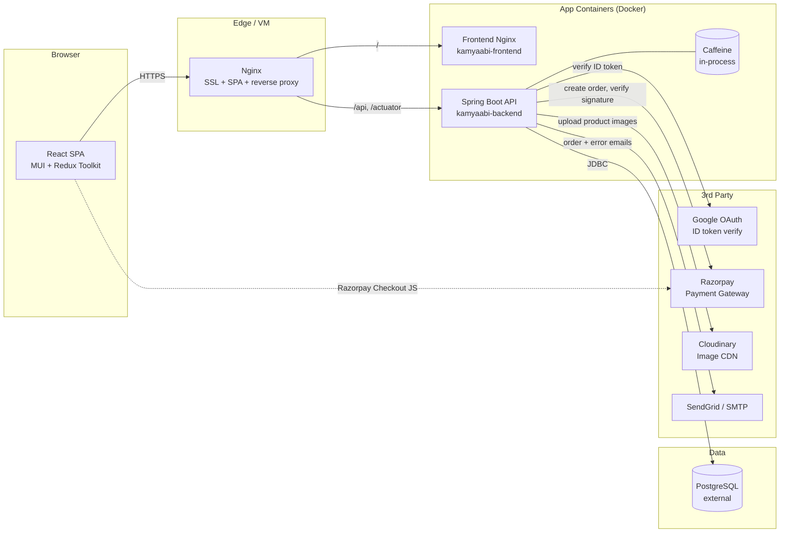

# Kamyaabi

> Premium dry-fruits eCommerce platform — browse, order, and pay online with Google Sign-In and Razorpay.

## Overview

**Kamyaabi** is a full-stack online store for premium dry fruits. Customers can
browse a curated catalog, search and filter by category, add items to a
shopping cart, sign in with Google, manage shipping addresses, pay securely
through Razorpay, and track each order through a step-by-step status timeline.

The platform is built for two audiences: **shoppers** who want a fast,
mobile-first storefront, and **store administrators** who need a single place
to manage products, categories, customers, orders, and basic sales analytics.
A role-based admin dashboard lives at `/admin` and is gated to users seeded
with the `ADMIN` role.

## Auth options

Primary authentication is Google OAuth + JWT. An optional WhatsApp OTP login
flow can be enabled from the admin Settings page. It stays hidden and disabled
by default.

To use WhatsApp OTP login, enable the feature in Admin Settings, set the
ChatMitra API token there, and ensure the ChatMitra dashboard has an approved
WhatsApp authentication template named by `CHATMITRA_WHATSAPP_OTP_TEMPLATE_NAME`
(default `otp_login`). The env vars remain as a fallback for self-hosted setups.

This repository hosts the entire stack — a Spring Boot REST API
(`kamyaabi-backend/`), a React + TypeScript single-page app
(`kamyaabi-frontend/`), Nginx and Certbot configuration for SSL termination,
and Docker Compose files that orchestrate the stack in development and
production. Production-grade observability (correlation IDs, structured
rolling logs with 10-day retention, Spring Boot Actuator health/metrics) is
wired in by default.

## Tech Stack

### Backend

| Technology | Version | Purpose |
|------------|---------|---------|
| Java | 17 | Language runtime |
| Spring Boot | 3.2.5 | Web framework, auto-config |
| Spring Security + OAuth2 Client | 3.2.x | Authentication, JWT, Google OAuth |
| Spring Data JPA / Hibernate | 3.2.x | ORM and repositories |
| PostgreSQL | 14+ (prod) | Primary database |
| H2 | runtime | In-memory database for local dev |
| Flyway | 9.x (via Boot) | Versioned schema migrations (prod) |
| Caffeine | latest | In-process read-aside cache |
| JJWT | 0.12.5 | JWT signing and parsing |
| Razorpay Java SDK | 1.4.6 | Payment order + signature verification |
| Cloudinary (cloudinary-http44) | 1.37.0 | Product image hosting |
| SendGrid Java | 4.10.2 | Transactional email (primary) |
| Spring Boot Starter Mail | 3.2.x | SMTP email fallback |
| Google API Client | 2.2.0 | Google ID token verification |
| springdoc-openapi | 2.5.0 | Swagger UI / OpenAPI docs |
| Lombok | latest | Boilerplate reduction |
| JUnit 5 + Mockito | latest | Unit tests |
| JaCoCo | 0.8.12 | Coverage gating (≥ 80% lines) |
| Maven | 3.6+ | Build tool |

### Frontend

| Technology | Version | Purpose |
|------------|---------|---------|
| React | 18.3 | UI framework |
| TypeScript | 5.5 | Static typing |
| Vite | 5.4 | Dev server / production bundler |
| Material UI (MUI) | 5.16 | Component library + theming |
| Redux Toolkit | 2.2 | State management (auth, cart, products, orders) |
| React Router | 6.26 | Client-side routing |
| Axios | 1.7 | HTTP client + JWT interceptor |
| @react-oauth/google | 0.13 | Google Sign-In button |
| Recharts | 3.8 | Admin analytics charts |
| ESLint + typescript-eslint | 9.x / 8.x | Linting |

### Infrastructure / DevOps

| Technology | Purpose |
|------------|---------|
| Docker / Docker Compose | Local + production container orchestration |
| Nginx | Reverse proxy, SPA routing, SSL termination |
| Certbot (Let's Encrypt) | Free SSL certificate issuance and renewal |
| GitHub Actions | CI: backend tests, frontend build, image push |

## Architecture

High-level flow from a shopper's browser through to the database and external
services:



**Request lifecycle.** Every HTTP request flows through a `TraceIdFilter`
that mints (or accepts) a correlation id, places it in the SLF4J MDC, and
echoes it back as the `X-Correlation-Id` response header. JWT-protected
routes pass through `JwtAuthenticationFilter` which verifies the bearer
token and populates the security context. Errors raised below the
controller layer are mapped by `GlobalExceptionHandler` to a uniform JSON
envelope (`{ status, error, message, traceId, fieldErrors? }`) and — for
production — emailed to `DEVELOPER_EMAILS` via `EmailService`.

**Module map.**

- `controller/` — thin REST adapters; one per aggregate (Auth, Product, Cart,
  Order, Payment, Address, Profile, Review, Admin, ErrorReport, Category).
- `service/` (+ `service/impl/`) — business logic, transactions, validation,
  caching, and orchestration of repositories + 3rd-party clients.
- `repository/` — Spring Data JPA repositories.
- `entity/` — JPA models (User, Category, Product, ProductImage, Cart,
  CartItem, Order, OrderItem, Payment, Address, Review).
- `security/` — `JwtTokenProvider`, `JwtAuthenticationFilter`, `CurrentUser`
  argument resolver, `SecurityConfig`.
- `config/` — CORS, cache, Swagger, multipart, async, email properties,
  `DataInitializer` (seeds admin user + sample categories/products).
- `email/` — `EmailService` abstraction with SendGrid primary + SMTP fallback,
  Actuator health indicator, async dispatch.
- `event/` — domain events (e.g. order placed) + listeners that drive emails.

On the frontend, the SPA is split into `pages/` (one per route),
`components/` (layout + shared + admin), `features/` (Redux slices for
auth, cart, product, order), `api/` (one Axios module per backend resource),
and `routes/AppRoutes.tsx` which guards `ProtectedRoute` /
`AdminRoute` using JWT + role.

## Prerequisites

You need the following exact versions (or newer minor versions) installed
locally:

| Tool | Version | Notes |
|------|---------|-------|
| Java JDK | 17 (Temurin recommended) | Backend build & run |
| Maven | 3.6+ | Backend build (or use `mvnw` if added) |
| Node.js | 18.x or 20.x | Frontend build & dev server |
| npm | 9+ | Frontend package manager |
| Docker | 20.10+ | Container builds |
| Docker Compose | v2+ | Stack orchestration |
| Git | 2.30+ | Source control |

For production deployment you additionally need:

- A Linux VM (Ubuntu 22.04+) with ports 80/443 reachable.
- A registered domain pointing to the VM.
- An external PostgreSQL 14+ database.
- Accounts for Google Cloud (OAuth client), Razorpay, Cloudinary, and a mail
  provider (SendGrid or any SMTP relay).

## Installation

```bash
# 1. Clone
git clone https://github.com/omprakashpeddamadthala/kamyaabi.in.git
cd kamyaabi.in

# 2. Configure environment
cp .env.example .env
#    edit .env — set DOMAIN, DATABASE_*, JWT_SECRET, GOOGLE_*, RAZORPAY_*,
#    CLOUDINARY_*, and (optionally) SENDGRID_API_KEY / SMTP_*.

# 3. Backend deps + build (uses dev profile + H2 by default, no DB needed)
cd kamyaabi-backend
mvn clean compile
cd ..

# 4. Frontend deps
cd kamyaabi-frontend
npm install
cd ..
```

> **Tip:** if you only want to try the app, the dev profile uses an
> in-memory H2 database and ships with `DataInitializer` seeding sample
> categories, products, and an admin user — you can skip step 2 and run with
> placeholders.

## Environment Variables

All secrets are read from environment variables. Nothing secret is checked
into the repo. The full template lives in [`.env.example`](.env.example).

### Backend

| Variable | Required | Default | Description |
|----------|----------|---------|-------------|
| `DOMAIN` | prod | `kamyaabi.in` | Public domain — drives Nginx, CORS, email defaults |
| `DATABASE_URL` | prod | `jdbc:h2:mem:kamyaabidb` | JDBC URL for the app database |
| `DATABASE_USERNAME` | prod | `sa` | DB username |
| `DATABASE_PASSWORD` | prod | _(empty in dev)_ | DB password |
| `JWT_SECRET` | yes | _(none — fails startup)_ | HS256 signing secret (≥ 32 bytes / 256 bits) |
| `JWT_EXPIRATION_MS` | no | `7200000` (2 h) | JWT lifetime in ms |
| `GOOGLE_CLIENT_ID` | yes | _(none)_ | Google OAuth web client id |
| `GOOGLE_CLIENT_SECRET` | yes | _(none)_ | Google OAuth client secret |
| `CORS_ALLOWED_ORIGINS` | yes | _(none)_ | Comma-separated frontend origins |
| `RAZORPAY_KEY_ID` | yes | _(none)_ | Razorpay public key id |
| `RAZORPAY_KEY_SECRET` | yes | _(none)_ | Razorpay secret key |
| `CLOUDINARY_CLOUD_NAME` | yes | _(none)_ | Cloudinary account cloud name |
| `CLOUDINARY_API_KEY` | yes | _(none)_ | Cloudinary API key |
| `CLOUDINARY_API_SECRET` | yes | _(none)_ | Cloudinary API secret |
| `PRODUCT_IMAGE_MAX_COUNT` | no | `5` | Max images per product |
| `EMAIL_ENABLED` | no | `true` | Master switch for outbound email |
| `EMAIL_FROM` | no | `noreply@${DOMAIN}` | Sender address |
| `EMAIL_FROM_NAME` | no | `Kamyaabi` | Sender display name |
| `ADMIN_EMAIL` | no | `admin@${DOMAIN}` | Admin notification address |
| `DEVELOPER_EMAILS` | no | _(empty)_ | Comma-separated alert list for unhandled exceptions |
| `SENDGRID_API_KEY` | no | _(empty → SMTP fallback)_ | SendGrid API key |
| `SMTP_HOST` / `SMTP_PORT` / `SMTP_USERNAME` / `SMTP_PASSWORD` | no | _(empty → no-op email)_ | SMTP fallback for transactional email |
| `APP_SUPPORT_EMAIL` / `APP_SUPPORT_URL` | no | derived from `DOMAIN` | Surfaced in OpenAPI metadata |
| `LOG_HOME` | no | `logs` (relative to `WORKDIR`) | Override for log file directory |

### Frontend (Vite build args)

| Variable | Required | Default | Description |
|----------|----------|---------|-------------|
| `VITE_API_BASE_URL` | no | _(empty = same origin via Nginx)_ | Backend base URL |
| `VITE_GOOGLE_CLIENT_ID` | yes (prod) | _(none)_ | Google OAuth client id (matches backend) |
| `VITE_BRAND_DOMAIN` | no | `kamyaabi.in` | Public brand domain rendered in UI |
| `VITE_SUPPORT_EMAIL` | no | _(default in code)_ | Support email rendered in UI |
| `VITE_SUPPORT_PHONE` | no | _(default in code)_ | 10-digit Indian phone for WhatsApp deep links |
| `VITE_DEV_ADMIN_EMAIL` | no (dev only) | `omprakashornold@gmail.com` | Email used by localhost-only "Login as Admin" dev button |
| `VITE_DEV_USER_EMAIL` | no (dev only) | `dev.user@kamyaabi.local` | Email used by localhost-only "Login as User" dev button |

Frontend env vars are consumed via `kamyaabi-frontend/src/config/index.ts`,
which throws in production builds when a required var is missing — preventing
broken deploys.

### Infrastructure (production deploy)

| Variable | Required | Default | Description |
|----------|----------|---------|-------------|
| `CERTBOT_EMAIL` | yes (prod) | `admin@${DOMAIN}` | Email registered with Let's Encrypt |
| `CERTBOT_STAGING` | no | `0` | Set to `1` to use staging CA (avoids rate limits) |
| `BACKEND_IMAGE_TAG` / `FRONTEND_IMAGE_TAG` | no | `latest` | Docker image tags used by `docker-compose.prod.yml` |

A complete sample is provided in [`.env.example`](.env.example). Copy it to
`.env` and fill in your own values before running Docker Compose.

## Running the App

### Development mode

```bash
# Terminal 1 — backend (dev profile, H2, seeded sample data)
cd kamyaabi-backend
mvn spring-boot:run -Dspring-boot.run.profiles=dev

# Terminal 2 — frontend (Vite dev server with HMR)
cd kamyaabi-frontend
npm run dev
```

- Frontend: <http://localhost:3000>
- Backend API: <http://localhost:8080>
- Swagger UI: <http://localhost:8080/swagger-ui.html>
- H2 console (dev only): <http://localhost:8080/h2-console>
- Actuator (admin-gated): <http://localhost:8080/actuator/health>

### Docker (full stack)

```bash
# Build and run both containers
docker compose up --build

# Detached
docker compose up --build -d

# Stop
docker compose down
```

This starts:

- `kamyaabi-backend` — Spring Boot, on `127.0.0.1:8080`
- `kamyaabi-frontend` — Nginx serving the built SPA, on `127.0.0.1:3000`

Logs are bind-mounted to `./logs/` on the host for easy `tail -f`.

### Production build

```bash
# Backend jar
cd kamyaabi-backend
mvn -DskipTests clean package

# Frontend bundle
cd ../kamyaabi-frontend
npm run build
```

Or use `docker-compose.prod.yml` together with `setup-vm-ssl.sh` and
`deploy.sh` to provision a Linux VM with Nginx + Certbot.

### Running tests

```bash
# Backend unit tests + JaCoCo coverage gate (≥ 80% lines)
cd kamyaabi-backend
mvn clean verify
# coverage report: target/site/jacoco/index.html

# Frontend type-check + production build (no separate test suite)
cd ../kamyaabi-frontend
npm run build
```

### Linting

```bash
cd kamyaabi-frontend
npm run lint
```

## Project Structure

```
kamyaabi.in/
├── kamyaabi-backend/                # Spring Boot REST API
│   ├── Dockerfile                   # Multi-stage JDK build
│   ├── pom.xml                      # Maven dependencies
│   └── src/
│       ├── main/
│       │   ├── java/com/kamyaabi/
│       │   │   ├── KamyaabiApplication.java
│       │   │   ├── config/          # CORS, Cache, Swagger, Multipart, Security, DataInitializer
│       │   │   ├── controller/      # Thin REST adapters (Auth, Product, Cart, Order, Payment, Admin, …)
│       │   │   ├── dto/             # Request / response payloads
│       │   │   ├── entity/          # JPA models (User, Product, Cart, Order, Payment, …)
│       │   │   ├── repository/      # Spring Data JPA repositories
│       │   │   ├── service/         # Business logic interfaces + impl/
│       │   │   ├── security/        # JwtTokenProvider, JwtAuthenticationFilter, CurrentUser
│       │   │   ├── mapper/          # Entity ↔ DTO mappers
│       │   │   ├── exception/       # Domain exceptions + GlobalExceptionHandler
│       │   │   ├── email/           # SendGrid + SMTP, Actuator health, templates
│       │   │   ├── event/           # Domain events + listeners (e.g. order placed)
│       │   │   └── validation/      # Custom @Valid annotations
│       │   └── resources/
│       │       ├── application.yml          # Common defaults
│       │       ├── application-dev.yml      # H2 + dev OAuth/JWT placeholders
│       │       ├── application-prod.yml     # PostgreSQL + Flyway + strict secrets
│       │       ├── application-docker.yml   # Docker Compose overrides
│       │       ├── logback-spring.xml       # Profile-aware rolling logs (10-day retention)
│       │       └── db/                      # Flyway migrations
│       └── test/java/com/kamyaabi/  # JUnit 5 + Mockito tests (≥ 80% line coverage)
│
├── kamyaabi-frontend/               # React SPA
│   ├── Dockerfile                   # Multi-stage Node + Nginx build
│   ├── nginx.conf                   # SPA fallback to index.html
│   ├── package.json
│   ├── vite.config.ts
│   ├── tsconfig*.json
│   └── src/
│       ├── main.tsx                 # React + Redux + MUI bootstrap
│       ├── api/                     # Axios modules (one per backend resource)
│       ├── components/              # Shared layout, common widgets, admin tabs
│       ├── config/                  # Env-validated runtime config
│       ├── features/                # Redux slices (auth, cart, product, order)
│       ├── hooks/                   # Typed Redux hooks
│       ├── pages/                   # Route components (Home, Products, Cart, Checkout, Orders, Admin, …)
│       ├── routes/AppRoutes.tsx     # Routing + ProtectedRoute / AdminRoute
│       ├── store/                   # Redux store
│       ├── theme/                   # MUI theme
│       ├── types/                   # Shared TypeScript types
│       └── utils/                   # Logger and helpers
│
├── nginx/                           # Host-VM Nginx config + Certbot bootstrap
├── docker-compose.yml               # Local dev — builds from source
├── docker-compose.prod.yml          # Production — pulls pre-built images
├── deploy.sh                        # One-shot deploy script for the VM
├── setup-vm-ssl.sh                  # Provisions Nginx + Let's Encrypt SSL
├── .env.example                     # Documented env-var template
├── .github/workflows/ci.yml         # GitHub Actions: tests + build + image push
├── docs/
│   ├── USER_GUIDE.md                # End-user guide (this PR)
│   └── screenshots/                 # UI screenshots referenced by the user guide
└── README.md                        # You are here
```

## API Reference

Base URL: `http://localhost:8080` (dev) or `https://${DOMAIN}` (prod). All
JSON. Authenticated endpoints expect `Authorization: Bearer <jwt>`. Full
schemas are available at `/swagger-ui.html`.

### Authentication — `/api/auth`

| Method | Path | Auth | Request body | Response | Description |
|--------|------|------|--------------|----------|-------------|
| POST | `/api/auth/google` | Public | `{ "credential": "<google id token>" }` | `{ token, user }` | Exchange Google ID token for app JWT |
| GET | `/api/auth/me` | User | — | `User` | Current authenticated user |
| GET | `/api/auth/success` | Public | — | redirect | OAuth2 success handler |
| GET | `/api/auth/failure` | Public | — | redirect | OAuth2 failure handler |

```bash
curl -X POST http://localhost:8080/api/auth/google \
  -H "Content-Type: application/json" \
  -d '{"credential":"<google-id-token>"}'
```

### Products — `/api/products`

| Method | Path | Auth | Description |
|--------|------|------|-------------|
| GET | `/api/products` | Public | Paginated list (`?page=&size=&sort=`) |
| GET | `/api/products/featured` | Public | Featured products for the home page |
| GET | `/api/products/search?q=` | Public | Full-text search by name |
| GET | `/api/products/category/{categoryId}` | Public | Filter by category |
| GET | `/api/products/{id}` | Public | Product detail by id |
| GET | `/api/products/slug/{slug}` | Public | Product detail by SEO slug |
| GET | `/api/products/{id}/redirect` | Public | 302 redirect from id → canonical slug URL |

```bash
curl "http://localhost:8080/api/products?page=0&size=12&sort=createdAt,desc"
```

### Categories — `/api/categories`

| Method | Path | Auth | Description |
|--------|------|------|-------------|
| GET | `/api/categories` | Public | List active categories |
| GET | `/api/categories/{id}` | Public | Category detail |

### Reviews — `/api/products/{productId}/reviews`

| Method | Path | Auth | Description |
|--------|------|------|-------------|
| GET | `/api/products/{productId}/reviews` | Public | List reviews for a product |
| GET | `/api/products/{productId}/reviews/summary` | Public | Aggregate rating + count |

### Cart — `/api/cart` _(JWT required)_

| Method | Path | Description |
|--------|------|-------------|
| GET | `/api/cart` | Get the current user's cart |
| POST | `/api/cart/items` | Add an item: `{ productId, quantity }` |
| PUT | `/api/cart/items/{itemId}` | Update quantity: `{ quantity }` |
| DELETE | `/api/cart/items/{itemId}` | Remove an item |

```bash
curl -X POST http://localhost:8080/api/cart/items \
  -H "Authorization: Bearer $JWT" -H "Content-Type: application/json" \
  -d '{"productId": 1, "quantity": 2}'
```

### Addresses — `/api/addresses` _(JWT required)_

| Method | Path | Description |
|--------|------|-------------|
| GET | `/api/addresses` | List current user's addresses |
| POST | `/api/addresses` | Create a new address |
| PUT | `/api/addresses/{id}` | Update an address |
| DELETE | `/api/addresses/{id}` | Delete an address |
| PUT | `/api/addresses/{id}/default` | Mark address as default |
| GET | `/api/addresses/states` | List supported Indian states |
| GET | `/api/addresses/states/{state}/cities` | List cities for a state |

### Orders — `/api/orders` _(JWT required)_

| Method | Path | Description |
|--------|------|-------------|
| POST | `/api/orders` | Create order from cart: `{ addressId, paymentMethod }` |
| GET | `/api/orders` | List current user's orders |
| GET | `/api/orders/{id}` | Order detail with items + status |

### Payments — `/api/payments` _(JWT required)_

| Method | Path | Description |
|--------|------|-------------|
| POST | `/api/payments/create-order` | Create a Razorpay order for a Kamyaabi order |
| POST | `/api/payments/verify` | Verify Razorpay signature on success |

```bash
curl -X POST http://localhost:8080/api/payments/create-order \
  -H "Authorization: Bearer $JWT" -H "Content-Type: application/json" \
  -d '{"orderId": 42}'
```

### Profile — `/api/profile` _(JWT required)_

| Method | Path | Description |
|--------|------|-------------|
| GET | `/api/profile` | Get profile (name, phone, etc.) |
| PUT | `/api/profile` | Update profile |

### Error reporting — `/api/errors`

| Method | Path | Auth | Description |
|--------|------|------|-------------|
| POST | `/api/errors/report` | Public | Frontend `ErrorBoundary` posts unhandled UI errors here |

### Admin — `/api/admin` _(`ROLE_ADMIN` required)_

| Method | Path | Description |
|--------|------|-------------|
| GET | `/api/admin/dashboard/stats` | Aggregate KPIs for the admin home |
| GET | `/api/admin/analytics` | Time-series analytics for charts |
| GET | `/api/admin/products` | Paginated products including soft-deleted |
| GET | `/api/admin/products/{id}` | Product detail (admin view) |
| POST | `/api/admin/products` (multipart) | Create product + upload images |
| PUT | `/api/admin/products/{id}` (multipart) | Update product + images |
| DELETE | `/api/admin/products/{id}` | Soft-delete product |
| POST | `/api/admin/products/{id}/restore` | Restore a soft-deleted product |
| PATCH | `/api/admin/products/{id}/status` | Toggle active/inactive |
| DELETE | `/api/admin/products/{id}/images/{imageId}` | Delete a single product image |
| GET | `/api/admin/categories` | List categories (admin view) |
| POST | `/api/admin/categories` | Create category |
| PUT | `/api/admin/categories/{id}` | Update category |
| DELETE | `/api/admin/categories/{id}` | Delete category |
| GET | `/api/admin/orders` | List all orders |
| PUT | `/api/admin/orders/{id}/status` | Update order status |
| GET | `/api/admin/users` | List users |
| PATCH | `/api/admin/users/{id}/role` | Change user role |
| PATCH | `/api/admin/users/{id}/status` | Activate / deactivate user |

### Standard error envelope

All errors are returned as JSON with the same shape:

```json
{
  "timestamp": "2026-05-01T08:30:00Z",
  "status": 422,
  "error": "Unprocessable Entity",
  "message": "Selling price must be less than MRP",
  "path": "/api/admin/products",
  "traceId": "1a2b3c…",
  "fieldErrors": { "sellingPrice": "must be less than MRP" }
}
```

The `traceId` is also returned in the `X-Correlation-Id` response header so
operators can grep server logs for the matching request.

## Key Features

1. **Google Sign-In with JWT sessions.** Customers authenticate with their
   Google account; the backend verifies the Google ID token and issues an
   HS256-signed JWT (default 2-hour lifetime). The frontend stores the token
   and an absolute expiry, surfaces a *Session expired* notice on lapse, and
   logs out cleanly.

2. **Product catalog with search and filters.** Paginated browsing,
   category-scoped listings, full-text search on names, and SEO-friendly
   slug URLs (`/products/almonds-premium-500g`). Featured products power the
   home-page hero strip.

3. **Product detail with images and reviews.** Each product page renders a
   responsive image gallery (Cloudinary-hosted), bullet-point description,
   tab-organised content, and an aggregate rating + review list.

4. **Shopping cart with optimistic updates.** Add, update, and remove items
   from any page; cart state is mirrored in Redux for instant feedback and
   reconciled with the server. A "fly-to-cart" animation confirms the action,
   and stale items are cleaned up when products are deleted.

5. **Address book.** Customers can save multiple shipping addresses, mark a
   default, and pick a delivery address at checkout. State + city options come
   from a backend-curated list to keep data clean.

6. **Razorpay checkout and payment verification.** A 3-step stepper walks the
   user through *Address → Review → Pay*. Payment opens Razorpay Checkout in
   a popup; on success the backend verifies the HMAC signature before marking
   the order **Paid**.

7. **Order tracking with step-by-step status.** Customers see every order in
   `/orders`, with a stepper visualising *Placed → Paid → Confirmed → Shipped
   → Delivered*. Admin status changes update this timeline in near real-time.

8. **Admin dashboard.** A role-gated `/admin` console surfaces sales KPIs,
   recent orders, a Recharts-powered analytics tab, and full CRUD for
   products (including multipart image upload to Cloudinary, soft-delete +
   restore), categories, and users (role + active flag).

9. **Transactional email.** Order confirmations and admin alerts are sent
   via SendGrid (preferred) with an SMTP fallback. Unhandled backend / frontend
   errors are emailed to `DEVELOPER_EMAILS` for fast triage.

10. **Production-grade observability.** Every request gets a correlation id
    (returned as `X-Correlation-Id` and present in MDC logs). Logback writes
    rolling daily files to `./logs/` with a 10-day retention. Spring Boot
    Actuator exposes `/health`, `/info`, `/metrics`, `/loggers`, and `/env`
    (admin-gated); a custom `EmailProviderHealth` indicator surfaces SMTP /
    SendGrid status.

11. **Caching.** Caffeine (`maximumSize=500, expireAfterWrite=10m`) backs
    read-heavy product / category lookups for fast home and listing pages.

12. **Containerised end-to-end.** `docker-compose.yml` builds and runs the
    full stack locally, while `docker-compose.prod.yml` plus `setup-vm-ssl.sh`
    and `deploy.sh` provision a Linux VM with Nginx + Let's Encrypt SSL.

## Contributing

1. **Fork** the repo and clone your fork.
2. **Create a feature branch** off `master`. Convention used in this repo:
   `devin/<unix-timestamp>-<short-description>` or
   `feat/<short-description>` / `fix/<short-description>`.
3. **Install pre-flight checks** locally — make sure `mvn verify` and
   `npm run lint && npm run build` both pass before pushing.
4. **Commit conventions.** Use [Conventional Commits](https://www.conventionalcommits.org/)
   with types `feat:`, `fix:`, `chore:`, `docs:`, `refactor:`, `test:`, `style:`.
   Keep subjects ≤ 72 chars and explain the *why* in the body.
5. **Open a Pull Request** against `master`. Each PR must:
   - Have a clear title and description (what + why).
   - Pass GitHub Actions CI (backend tests + 80% coverage + frontend build +
     Docker image build).
   - Add or update tests for any changed behaviour.
   - Touch documentation (this README or `docs/`) if behaviour visible to
     users or operators changes.

PR checklist:

- [ ] Code compiles locally (`mvn verify` and `npm run build`).
- [ ] Backend coverage stays at or above 80% lines.
- [ ] No secrets, API keys, or `.env` files committed.
- [ ] Linter is green (`npm run lint`).
- [ ] User-facing changes documented in `docs/USER_GUIDE.md`.
- [ ] PR description references the issue / task it addresses.

## License

This project is **proprietary**. All rights reserved by the repository
owner. No license is granted for redistribution, sublicensing, or
commercial use without explicit written permission. If you would like to
discuss licensing or partnership, please contact the repository owner via
the support email configured in `.env` (defaults to `support@kamyaabi.in`).

### Invoice Generation

Paid orders automatically receive a PDF tax invoice after the payment-success order event commits. The flow is:

1. `PaymentServiceImpl.verifyPayment()` marks the payment `COMPLETED`, marks the order `PAID`, saves both records, and publishes `OrderEventType.PAYMENT_SUCCESS`.
2. `OrderEventListener` runs after commit, queues invoice generation on `invoiceTaskExecutor`, and keeps the existing email notification flow non-blocking.
3. `InvoiceService` renders a professional A4 invoice PDF, stores it on disk, and persists `invoice_number` / `invoice_url` on the order. Generation is idempotent: if the stored PDF exists, the same invoice is reused.
4. `OrderEmailService` attaches the invoice PDF to customer payment-success/COD emails. Admin notification emails remain unchanged.
5. Customers can download invoices from `GET /api/orders/{orderId}/invoice` or request `?format=url`; admins can use `GET /api/admin/orders/{orderId}/invoice`.

Invoice configuration lives under `app.invoice.*` and is backed by these environment variables:

| Variable | Purpose | Default |
| --- | --- | --- |
| `INVOICE_STORAGE_DIRECTORY` | Filesystem directory for generated PDFs. Use persistent storage in production. | `/app/invoices` |
| `INVOICE_COMPANY_NAME` | Company name shown in invoice header. | `Kamyaabi` |
| `INVOICE_COMPANY_ADDRESS` | Company address shown in invoice header. | `Premium Dry Fruits, India` |
| `INVOICE_COMPANY_EMAIL` | Support email in invoice header/footer. | `support@kamyaabi.in` |
| `INVOICE_COMPANY_PHONE` | Company phone shown in invoice header. | `+91 9848999072` |
| `INVOICE_COMPANY_WEBSITE` | Company website shown in invoice header/footer. | `https://kamyaabi.in` |
| `INVOICE_LOGO_URL` | Optional HTTPS logo image URL. If blank, a text logo placeholder is used. | blank |
| `INVOICE_CURRENCY` | Currency symbol mapping for invoice totals. | `INR` |
| `INVOICE_TAX_LABEL` / `INVOICE_TAX_RATE` | Tax label and display rate. | `GST` / `0%` |
| `INVOICE_REFUND_POLICY_NOTE` | One-line refund/return note in the footer. | Kamyaabi refund policy note |
