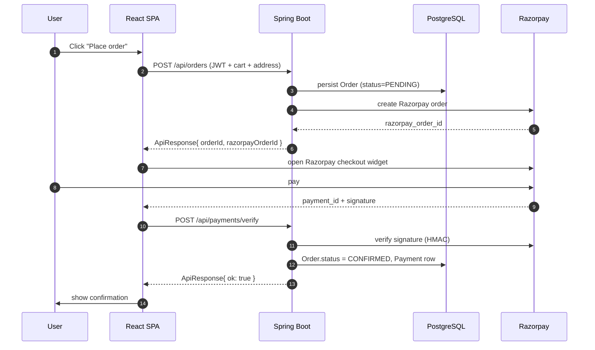

# Architecture

This document describes the high-level architecture of Kamyaabi: the major
components, how they communicate, and the responsibilities of each layer.

## 1. System overview

```
┌──────────────┐       HTTPS        ┌─────────────────────────┐
│   Browser    │ ─────────────────▶ │  Nginx (VM / container) │
│ (React SPA)  │                    │  - TLS termination      │
└──────┬───────┘                    │  - / → frontend static  │
       │                            │  - /api → backend proxy │
       │                            └────────────┬────────────┘
       │                                         │
       │ static assets                           │ reverse proxy
       │ served from Nginx                       ▼
       │                             ┌─────────────────────────┐
       │                             │  Spring Boot backend    │
       │                             │  (kamyaabi-backend)     │
       │                             └────────────┬────────────┘
       │                                          │
       │ REST /api/*                              │
       ▼                                          ▼
┌─────────────────┐                  ┌─────────────────────────┐
│ Google Identity │◀────────────────▶│ PostgreSQL (prod) / H2  │
│  Services (JS)  │   ID-token       │ (dev, in-memory)        │
└─────────────────┘                  └─────────────────────────┘
                                                  │
                                                  ▼
                                     ┌─────────────────────────┐
                                     │  Razorpay / SendGrid /  │
                                     │  SMTP  (external APIs)  │
                                     └─────────────────────────┘
```

## 2. Request flow (happy-path checkout)



## 3. Backend layering

`kamyaabi-backend/src/main/java/com/kamyaabi/`

```
┌──────────────────────────────────────────────────────────────────┐
│ controller/   ← HTTP adapter; @RestController; no business logic │
│    │                                                             │
│    ▼                                                             │
│ service/  (interfaces) → service/impl/ (implementations)         │
│    │                                                             │
│    ▼                                                             │
│ repository/   ← Spring Data JPA                                  │
│    │                                                             │
│    ▼                                                             │
│ entity/       ← JPA @Entity classes                              │
└──────────────────────────────────────────────────────────────────┘
Supporting packages:
  dto/request/         DTOs bound from request bodies (@Valid)
  dto/response/        DTOs returned to clients (incl. ApiErrorResponse)
  mapper/              hand-written entity ↔ DTO mappers
  exception/           custom exceptions + GlobalExceptionHandler
  config/              CORS, cache, security primitives, CorrelationIdFilter,
                       @ConfigurationProperties classes, custom health
                       indicators
  security/            JWT provider/filter, OAuth2 user service, CurrentUser
  event/               Spring ApplicationEvents for order lifecycle
  email/               EmailService interface + SendGrid/SMTP/NoOp impls
  validation/          custom Jakarta Validation validators
```

### Rules

- **Controllers** call services, translate exceptions via the global handler, and never touch repositories.
- **Services** never return entities to callers; they translate via mappers to DTOs.
- **Repositories** never leak `Optional<Entity>.get()` without an `isPresent()` / `orElseThrow` check.
- **Entities** are never serialised directly to the wire.

## 4. Frontend layering

`kamyaabi-frontend/src/`

```
pages/                 Route-level components; thin, delegate to features/
  ↳ features/          Feature-scoped components + Redux slices
      ↳ components/    Shared presentational components
          ↳ api/       Axios-based API modules (by domain)
              ↳ store/, types/, config/, utils/
```

- `api/axiosInstance.ts` attaches the auth header, runs the session-timeout
  check, and centralises 401/403/500 handling via window events.
- `config/index.ts` is the only place that reads `import.meta.env.*`.
- `utils/logger.ts` is the only place that calls `console.*`.
- `components/common/ErrorBoundary.tsx` wraps the router so a single bad
  render can't unmount the whole app.

## 5. Cross-cutting concerns

### 5.1 Correlation id / trace id

`CorrelationIdFilter` is the first filter in the Spring chain
(`Ordered.HIGHEST_PRECEDENCE`). It assigns a UUID per request (or reuses the
`X-Correlation-Id` header if supplied), writes it to SLF4J `MDC` under the
`correlationId` key, and echoes it back on the response.

- Every log line rendered through `logback-spring.xml` includes it.
- Every `ApiErrorResponse` includes it as `traceId`.
- The frontend reads it from either the header or the error body
  (`extractTraceId` in `axiosInstance.ts`) and surfaces it in error toasts.

### 5.2 Authentication

- Google Identity Services JS on the frontend posts a Google ID token to
  `POST /api/auth/google`.
- `AuthService` verifies the ID token against Google's public certs and
  upserts a `User` row.
- `JwtTokenProvider` issues an HS256 JWT embedding `userId`, `email`, `role`.
- `JwtAuthenticationFilter` validates the JWT on every subsequent request.
- Spring Security's `@EnableMethodSecurity` lets controllers use `@PreAuthorize`.

### 5.3 Error handling

- Every exception is routed through `GlobalExceptionHandler`.
- Responses always carry a `traceId` from MDC.
- The catch-all 500 branch logs the full stack, but the wire response
  message is sanitised.

### 5.4 Config & secrets

- All secrets come from environment variables (`${DB_PASSWORD}` etc.). See
  `.env.example` at the repo root for the canonical list.
- `AppProperties` + `EmailProperties` are `@ConfigurationProperties`-bound
  and `@Validated`, so malformed configuration fails fast at startup.
- `docker-compose.yml` wires env vars into both containers; Nginx serves
  TLS for the stack.

## 6. Deployment topology

See [`docs/DEPLOYMENT.md`](./DEPLOYMENT.md) for the Oracle Cloud VM + Nginx +
Certbot setup, container images (published to Docker Hub via GitHub Actions),
and the `deploy.sh` / `setup-vm-ssl.sh` operational scripts.
