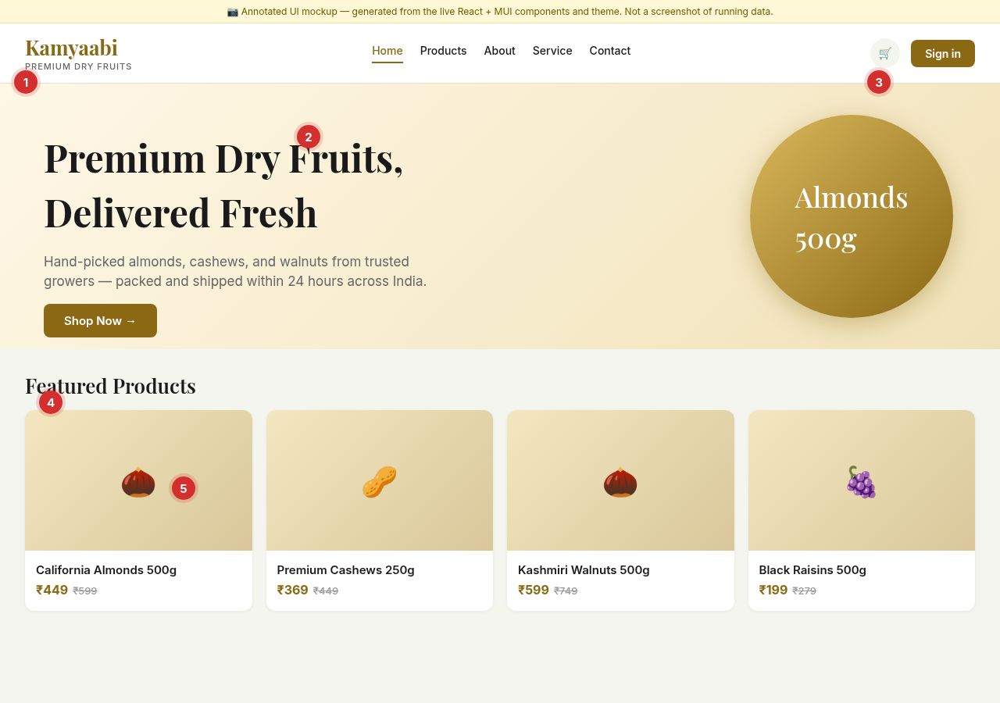
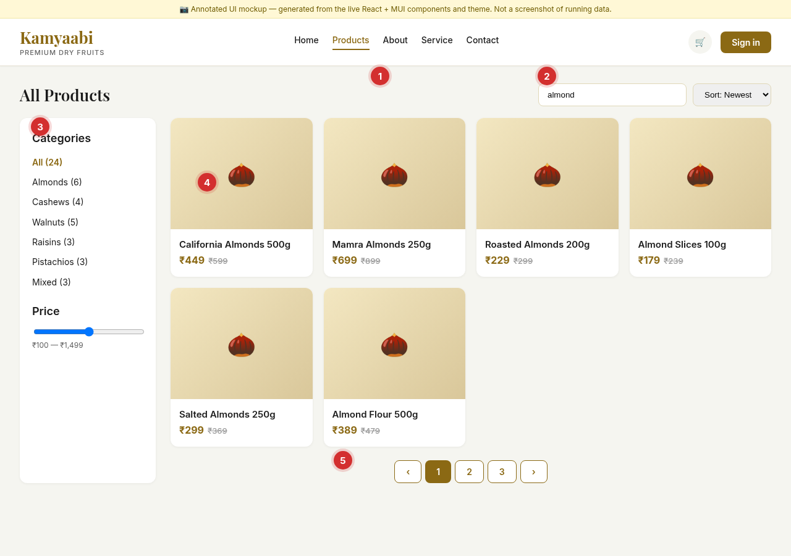
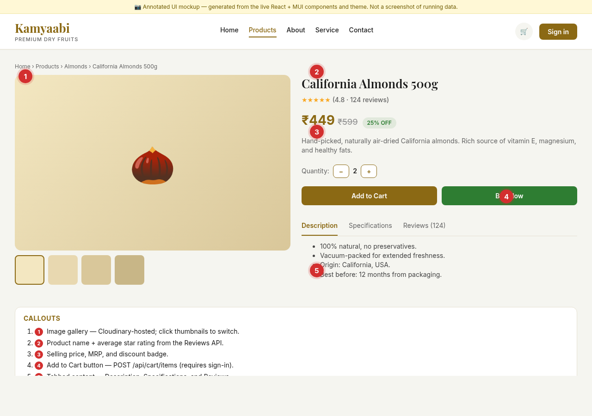
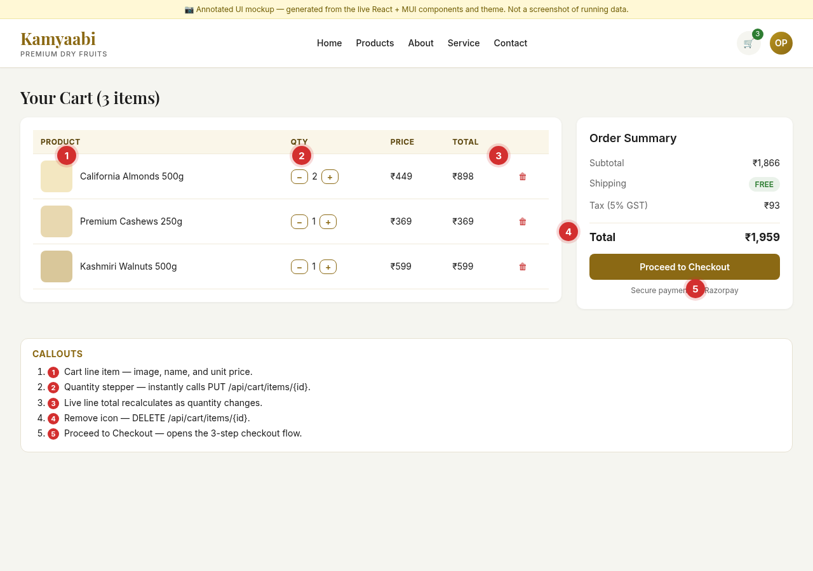
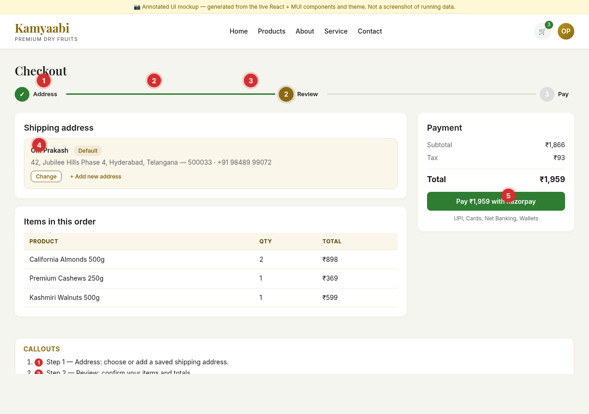
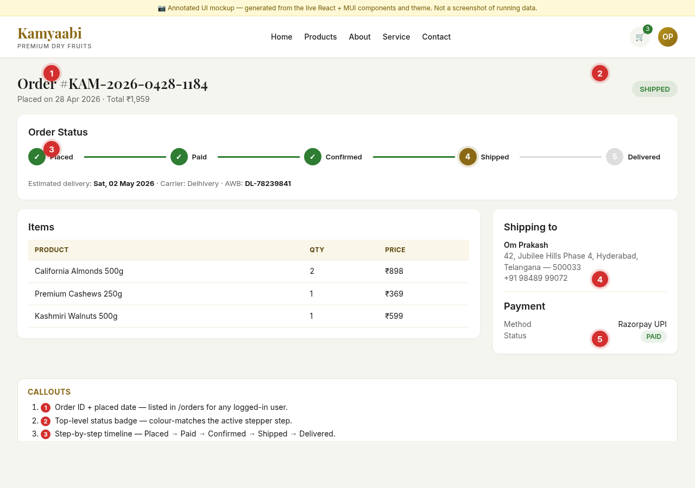
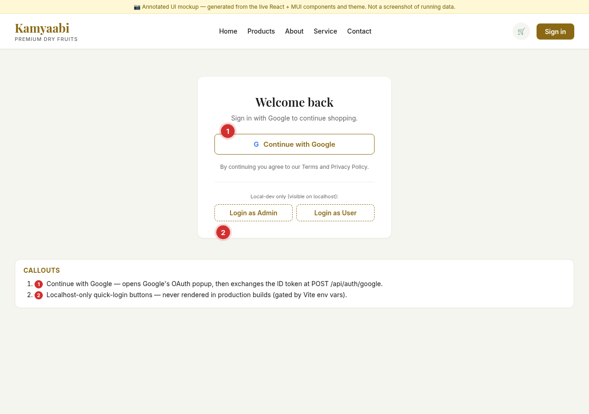
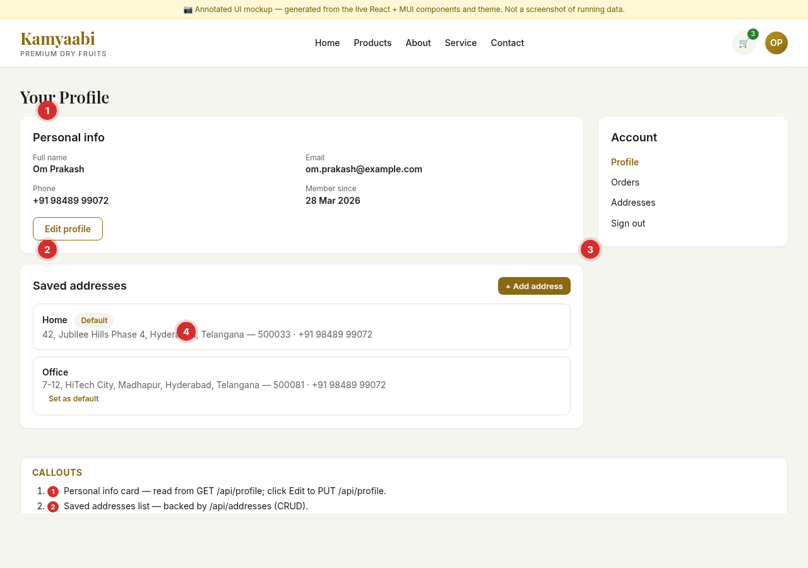
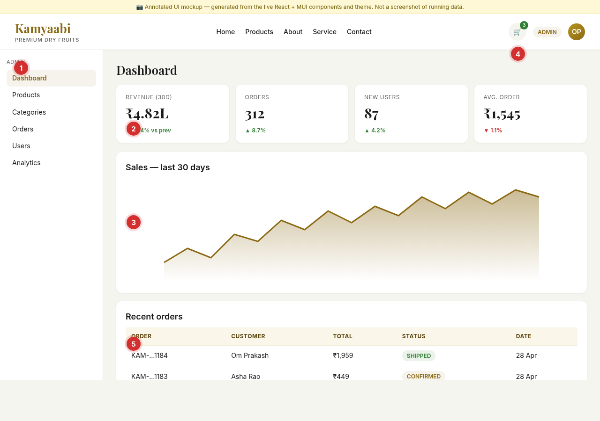
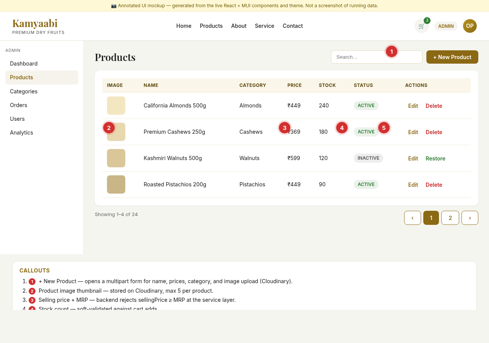

# User Guide — Kamyaabi

> **Note on screenshots.** The images below are annotated UI mockups generated
> from the live React + Material UI components and the project's actual MUI
> theme. They use the same colours, fonts, layouts, and route structure as
> the running app — but the data shown is illustrative.

---

## Introduction

**Kamyaabi** is an online store for premium dry fruits. With Kamyaabi you
can browse a curated catalog of almonds, cashews, walnuts, raisins,
pistachios and mixed dry-fruit packs, sign in with your Google account, save
shipping addresses, pay securely with Razorpay (UPI, cards, net-banking, or
wallets), and follow each order through a step-by-step tracking timeline.

This guide is for **end users** — shoppers who just want to buy something —
and for **store administrators** who manage products, categories, customers,
and orders. No technical knowledge is required.

If you are a developer setting up the project locally, please read
[`../README.md`](../README.md) first.

---

## Getting Started

### How to access the app

- **Production:** open the website URL configured by your administrator
  (the default brand domain is `kamyaabi.in`).
- **Local development:** start the stack with
  `docker compose up --build` from the project root and open
  <http://localhost:3000>.

### Browsing without an account

You can browse the home page, view the full product catalog, search,
filter by category, and read product details + reviews **without signing
in**. Sign-in is only required when you are ready to add items to your
cart, save addresses, or place an order.

### Creating an account / signing in

Kamyaabi uses **Google Sign-In** — there is no separate password. The
first time you click *Continue with Google*, the app creates your account
automatically using the name and email returned by Google. Subsequent
sign-ins are one-click.

> **Tip:** sessions last **2 hours**. After that, you'll be returned to
> the sign-in page with a *Session expired* notice — just sign in again.

---

## Feature Walkthroughs

### 1. Home page

**What it does.** A friendly landing page that introduces Kamyaabi and
shows a strip of *Featured Products* curated by the team.

**How to use it**

1. Open the website URL.
2. Skim the hero banner for promotions and new arrivals.
3. Click **Shop Now** to jump to the full catalog, or click any featured
   product card to open its detail page.
4. Use the **Cart** icon in the top-right to view your shopping cart at
   any time.

**Callouts**

1. Brand logo — clicking it returns to the home page from anywhere.
2. Hero banner with a primary call-to-action that opens **Products**.
3. Cart icon — shows the item count and opens the cart from any page.
4. Featured products section, fed from the backend's *Featured* API.
5. Product card — click anywhere on the card to open the product detail.

**Tips & common mistakes**

- The featured strip shows up to 4 items; for the full catalog click
  **Shop Now** or **Products** in the top navigation.
- The cart badge only updates after you sign in.

---

### 2. Browse all products

**What it does.** Lets you browse the complete catalog with category
filters, search, sorting, and pagination.

**How to use it**

1. Click **Products** in the top navigation.
2. (Optional) Type a keyword (e.g. *almond*) into the **Search** box.
3. (Optional) Pick a category from the left sidebar to narrow the list.
4. (Optional) Use the **Sort** dropdown to sort by Newest, Price Low → High,
   or Price High → Low.
5. Click any product card to open its detail page.
6. Use the pagination buttons at the bottom of the grid to navigate pages.

**Callouts**

1. Search box — filters by product name as you type.
2. Sort selector — newest first, or by price.
3. Category filter — narrows the listing to a single category.
4. Product grid — paginated; each card is clickable.
5. Pagination controls — server-side paginated.

**Tips & common mistakes**

- Search is **name-based** — searching for *raisin* matches *Black Raisins
  500g* but not *Premium Cashews 250g*.
- The Price slider, when present, applies after you release the handle.

---

### 3. Product detail page

**What it does.** Shows large images, full description, specifications,
ratings, and reviews for a single product, and lets you add it to the
cart.

**How to use it**

1. From any catalog page, click a product card.
2. Click the small thumbnails under the main image to switch images.
3. Use the **−** / **+** buttons to choose a quantity.
4. Click **Add to Cart** to add it to your shopping cart, or **Buy Now**
   to add it and jump straight to checkout.
5. Scroll down and switch between **Description**, **Specifications**, and
   **Reviews** to read more about the product.

**Callouts**

1. Image gallery — Cloudinary-hosted; click thumbnails to switch.
2. Product name and average rating from the Reviews API.
3. Selling price, MRP (struck through), and the discount badge.
4. **Add to Cart** button — requires sign-in; if you're not signed in
   the app sends you to the sign-in page first.
5. Tabbed content — Description bullet points, Specifications table,
   and customer Reviews.

**Tips & common mistakes**

- If you see a *Sign in to add to cart* prompt, just click **Continue
  with Google**; you'll be brought back to this page automatically.
- The discount badge is computed from MRP vs Selling price — products
  without an MRP simply show the selling price.

---

### 4. Shopping cart

**What it does.** Holds the items you intend to buy; lets you change
quantities and remove items before you check out.

**How to use it**

1. Click the **Cart** icon in the top-right (or open `/cart`).
2. Use the **−** / **+** controls to change quantity for each item.
3. Click the trash icon to remove an item.
4. Review the **Order Summary** on the right (subtotal, shipping, tax,
   total).
5. Click **Proceed to Checkout** when you're ready.

**Callouts**

1. Cart line item — image, name, and unit price.
2. Quantity stepper — instantly updates the line on the server.
3. Live line total recalculates as quantity changes.
4. Remove (trash) icon — removes a line from the cart.
5. **Proceed to Checkout** — opens the 3-step checkout flow.

**Tips & common mistakes**

- If a product is removed by an admin while it's in your cart, the cart
  line is **automatically cleaned up** the next time you load the cart.
- Shipping is **FREE** above a configurable threshold; the indicator on
  the right tells you the current applied shipping cost.

---

### 5. Checkout (3-step stepper)

**What it does.** Collects your shipping address, lets you confirm the
items, and opens the Razorpay payment popup.

**How to use it**

1. From the cart, click **Proceed to Checkout**.
2. **Step 1 — Address.** Pick a saved address (your default is selected
   automatically) or click **+ Add new address** to enter one. Click
   **Next** to continue.
3. **Step 2 — Review.** Confirm the items, quantities, and totals.
4. **Step 3 — Pay.** Click **Pay ₹X,XXX with Razorpay**. The Razorpay
   Checkout popup opens; choose UPI, card, net-banking, or a wallet, and
   complete the payment.
5. On success you're redirected to the **Order detail** page and the
   stepper jumps to **Paid**.

**Callouts**

1. Step 1 — Address: choose or add a saved address.
2. Step 2 — Review: confirm items and totals.
3. Step 3 — Pay: opens the Razorpay popup.
4. Default-address card — picked automatically if you have one marked
   default.
5. Razorpay **Pay** button — securely opens Razorpay Checkout.

**Tips & common mistakes**

- Razorpay Checkout is a **popup**. If it's blocked, your browser shows a
  popup-blocker icon next to the URL bar — allow popups for the site and
  click **Pay** again.
- Closing the Razorpay popup before completing payment leaves the order
  in **Placed** (not yet paid). You can retry payment from
  the order detail page.

---

### 6. Order tracking

**What it does.** Shows a live timeline for every order you've placed.

**How to use it**

1. Click your **avatar** in the top-right and choose **Orders**, or open
   `/orders`.
2. Click any order to open its detail page.
3. Read the step-by-step timeline at the top of the page.
4. Scroll down to see line items, the shipping address used, and the
   payment status.

**Callouts**

1. Order ID and the date the order was placed.
2. Top-level status badge — colour-matches the active step.
3. Step-by-step timeline: **Placed → Paid → Confirmed → Shipped →
   Delivered**.
4. Shipping address used for this order.
5. Payment summary — method (UPI / card / etc.) and verified status.

**Tips & common mistakes**

- The stepper updates as the admin moves the order through fulfilment;
  refresh the page to see the latest status.
- Tracking number / carrier appear once the admin moves the order to
  **Shipped**.

---

### 7. Sign in with Google

**What it does.** One-click authentication using your Google account; no
password to remember.

**How to use it**

1. Click **Sign in** in the top-right (or any *Sign in to continue*
   prompt).
2. Click **Continue with Google**.
3. Pick the Google account you want to use in the popup.
4. You'll land back on Kamyaabi, signed in.

**Callouts**

1. **Continue with Google** — the only authentication method in
   production.
2. Localhost-only quick-login buttons — visible only on local
   development builds (used by maintainers to quickly test admin and
   user flows). They are **never** rendered in production.

**Tips & common mistakes**

- Sessions expire after 2 hours. The app clears your session
  automatically and shows a *Session expired* notice.
- If Google says *App not verified*, your administrator probably hasn't
  configured the OAuth consent screen yet — contact them.

---

### 8. Profile and address book

**What it does.** Lets you view and edit your name and phone number, and
manage multiple shipping addresses.

**How to use it**

1. Click your avatar in the top-right and choose **Profile**.
2. Click **Edit profile** to update your name or phone.
3. In **Saved addresses**, click **+ Add address** to add a new address.
4. To change the default address, click **Set as default** on any
   non-default card.
5. Click the small ✏ icon on a card to edit, or 🗑 to delete.

**Callouts**

1. Personal info card — name, email (read-only, from Google), phone, and
   member-since date.
2. Saved addresses list — pick one, edit, or remove.
3. **+ Add address** — opens a modal with state and city dropdowns.
4. **Default** badge — only one address can be the default.

**Tips & common mistakes**

- Email is sourced from Google and **cannot** be edited here.
- When you delete an address that's currently the default, set another
  address as default first.

---

### 9. Admin dashboard *(admin role only)*

**What it does.** A high-level overview of revenue, orders, new users,
and average order value, plus a sales chart and recent-orders table.

**How to use it (admins only)**

1. Sign in with an account that has the **ADMIN** role.
2. Click your avatar and choose **Admin**, or open `/admin`.
3. The **Dashboard** tab is selected by default.
4. Use the left sidebar to switch between **Dashboard**, **Products**,
   **Categories**, **Orders**, **Users**, and **Analytics**.

**Callouts**

1. Admin sidebar — links to each admin tab.
2. KPI tiles — revenue, orders, new users, average order value.
3. Sales chart (Recharts) — shows the last 30 days at a glance.
4. ADMIN role badge in the top bar — only admin accounts see `/admin`.
5. Recent-orders table — clickable rows open the admin order detail.

**Tips & common mistakes**

- KPI deltas (▲ / ▼) compare to the previous period; a downward arrow
  isn't necessarily bad if your prior period was unusually large.
- The dashboard pulls live data from the backend — if a tile shows
  *N/A*, check that the backend is reachable.

---

### 10. Admin product management *(admin role only)*

**What it does.** Lets administrators create, edit, soft-delete, and
restore products, including uploading product images.

**How to use it (admins only)**

1. From the admin dashboard sidebar, click **Products**.
2. Use the **Search** box to find a product by name.
3. Click **+ New Product** to open the create form.
4. Fill in name, category, MRP, selling price, stock count, and a short
   description.
5. Drag-and-drop or pick up to **5** images (uploaded to Cloudinary).
6. Click **Save**. The product appears in the list with status **ACTIVE**.
7. Click **Edit** on a row to change details, or **Delete** to soft-delete
   (the row becomes **INACTIVE** and is hidden from shoppers — you can
   **Restore** it later).

**Callouts**

1. **+ New Product** — opens a multipart form (name, prices, category,
   images).
2. Product image thumbnail — stored on Cloudinary; max 5 per product.
3. Selling price + MRP — the backend rejects products where Selling
   ≥ MRP.
4. Stock count — soft-validated against cart adds.
5. Status badge — soft-deleted products are **INACTIVE** and can be
   restored.

**Tips & common mistakes**

- Image uploads are limited to image content types; PDFs or random files
  are rejected before they reach Cloudinary.
- The MRP must be **strictly greater than** the selling price, otherwise
  saving the product fails with a validation error.

---

## FAQs

**1. Do I need an account to browse the catalog?**
No. You can browse, search, filter, and read product details without
signing in. Sign-in is only required to add items to your cart or
checkout.

**2. How do I sign in?**
Click **Sign in** in the top-right and choose **Continue with Google**.
We use your Google account for authentication, so there is no separate
password.

**3. How long does my session last?**
Your sign-in lasts **2 hours**. After that, you'll see a *Session
expired* notice and need to sign in again.

**4. Which payment methods are supported?**
Payments are processed by **Razorpay**, which supports UPI, credit/debit
cards, net-banking, and popular Indian wallets. Cash on delivery is not
currently offered.

**5. How do I track my order?**
Click your avatar → **Orders**, then click the order you want to view.
The top of the order page shows a step-by-step timeline (Placed → Paid
→ Confirmed → Shipped → Delivered).

**6. My payment popup didn't open. What now?**
Your browser is probably blocking popups. Allow popups for the site (the
icon usually appears in the right of the address bar) and click **Pay**
again. Your order remains in *Placed* until payment is verified.

**7. The site says I'm an admin but I can't see `/admin`. Why?**
Admin access is granted to specific email addresses seeded by the
backend (`DataInitializer`). If your account isn't seeded as admin,
contact the repository owner to be added.

**8. Can I get a refund?**
Refunds are processed by Razorpay back to the original payment source.
Email the support address shown in the footer (configured via
`VITE_SUPPORT_EMAIL`).

---

## Troubleshooting

| Error | Likely Cause | Fix |
|-------|--------------|-----|
| *Session expired. Please sign in again.* | Your JWT is older than 2 hours. | Click **Sign in** and continue with Google again. |
| *Cart is empty* after sign-in | You added items as a guest, then signed in with a different browser/incognito. | The cart belongs to your account; add the items again while signed in. |
| Razorpay popup is blocked | Browser popup-blocker. | Allow popups for the Kamyaabi domain and click **Pay** again. |
| *Selling price must be less than MRP* (admin) | Product has `sellingPrice ≥ mrp`. | Lower the selling price or raise the MRP. |
| *Maximum 5 images per product* (admin) | Trying to upload a 6th image. | Delete an existing image first, then re-upload. |
| *App not verified* on Google sign-in | Google OAuth consent screen isn't configured. | Repository owner: complete OAuth verification or add testers in Google Cloud Console. |
| 502 Bad Gateway from `/api/...` | Backend container is down. | `docker compose ps`; restart with `docker compose up -d backend`. |
| Cloudinary uploads fail with `401` | Wrong `CLOUDINARY_API_KEY` / `CLOUDINARY_API_SECRET`. | Re-copy values from the Cloudinary dashboard into `.env` and restart. |
| `mvn verify` fails on coverage | New code without tests pushed coverage below 80%. | Add tests for the new code, then re-run `mvn verify`. |
| *Address creation fails: state not allowed* | Backend curates the list of supported states. | Pick from the dropdown; `/api/addresses/states` is the source of truth. |

---

## Glossary

- **Cart** — A list of products you intend to buy, kept against your
  account on the server. Surviving page reloads.
- **Checkout** — The 3-step flow (Address → Review → Pay) that converts
  a cart into an order.
- **JWT** — JSON Web Token. A signed string the app uses to prove who
  you are on each request. Issued at sign-in, expires after 2 hours.
- **MRP** — Maximum Retail Price. The list price printed on the
  packaging; we always show selling price below MRP.
- **OAuth / Google Sign-In** — A standard for delegating login to Google.
  We never see or store your Google password.
- **Order status** — One of *Placed, Paid, Confirmed, Shipped, Delivered*
  (or *Cancelled*). The stepper on each order page shows where you are.
- **Razorpay** — The Indian payment gateway used to accept UPI, card,
  net-banking, and wallet payments.
- **ROLE_ADMIN** — A user permission that unlocks the `/admin` console.
  Granted by the backend's `DataInitializer` for seeded admin emails.
- **Soft delete** — Marking a record (e.g. a product) as inactive
  instead of removing it from the database, so it can be restored later
  and historical orders still resolve correctly.
- **Slug** — The SEO-friendly piece of a product URL, e.g.
  `california-almonds-500g` in `/products/california-almonds-500g`.
- **Cloudinary** — The third-party CDN where product images are stored
  and served from.
- **SendGrid / SMTP** — Two ways the backend can send transactional
  emails (order confirmations, error alerts). SendGrid is preferred;
  SMTP is the fallback.
- **Correlation ID / Trace ID** — A unique id attached to every request,
  shown in error responses and the `X-Correlation-Id` header. Useful for
  support: include it when reporting an issue.

---

If you spot anything that's out of date or want a feature explained
better, please open an issue or a PR — see [Contributing](../README.md#contributing).
